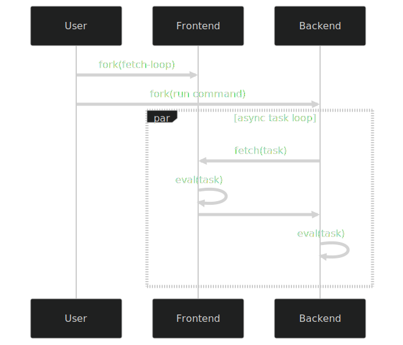

This document discusses the evolution of the formatter system. The problem is how to preprocess stderr output with styling (such as colors), in a way that is composable and maintains clarity of semantics.

This template is inspired by the formats of [this](https://github.com/ocaml-multicore/eio/blob/main/doc/rationale.md). We use it flexibly to express design tradeoffs.

## Formatter

In XXXX, we introduced formatters, a preprocessing stage to add colors to stderr output.

1. We use formatters that can be combined.
2. We use formatters that can be one-way combined by extending with additional rules (legacy)
3. We use the same formatter for all cases (current)

Exibit 1 is ideal. However, there's currently no formatter implementation in the OCaml ecosystem that allows combination [^redirect].

Exibit 2 is adopted by the current system. This is implemented by the `Microcluster_exec.Format` formatters. These are extended versions of `Stdlib.Format` formatters in that they allow you to specify addition _styling rules_. By this system, the default Microcluster_exec semantics are implemented by `Microcluster_exec.Format.<private>translate`, while the modifications to the Cmdliner recolors are implemented by `Microcluster_exec.Format.Cmdliner.Re.styles`. So, this method works. The issue is that there's a hierarchy between the default semantics and the Cmdliner recolors, where the former is prioritized / first applied. Furthermore, this styling rule system adds complexity to the preprocessing function.

Exhibit 3 is what we concluded with. The reason we initially didn't consider this is because of performance reason, because recoloring cmdliner was an exclusive task for cmdliner. But it's upon that we realize the big picture: from a cmdliner user perspective, there's no difference between the stderr output of cmdliner, and that of the rest of the app - the two should be seen as one. The `?err` argument in `Cmdliner.eval` is an customization override, but that isn't meant to break the picture. Exhibit 3 has best declarativeness, at the slight cost of performance. But from a high-level programming perspective, performance optimization should be an addition underneath the abstraction, not a mainline abstraction.

## Clientside interceptor

Regarding communication between the frontend interpreter (Micro-cluster Execute) and the backend interpreter (Python / UTop).

1. Frontend and backend define the code to communicate, as long as they follow the fs_socket protocol and the Controller spec.

2. Frontend defines the code to communicate, defines the protocol and spec, sends some portion to the backend  - inversion of control (current).

In exhibit 1. It is the default way, classic client-server pattern, it is easy and straightforward. The challenge is that the protocol that the frontend and backend follows is only partially seen from each side: for the overview, you need a kind of document.

In exhibit 2. All communication logic is defined by the frontend; the flow of communication can be overly and readily observed in one file `/microcluster_exec/bin/main.ml` without jumping between different code repositories. The challenge is that there will be some performance implications; and there's difficulty in language: as we define this callback in OCaml-land, we have to translate and send this callback to Python-land. At least for the latter challenge, we invented `Microcluster_exec.Clientside`, a monadic way to write portable programs with the Python abstract syntax tree being the intermediate representation. Of course, all of this is further complicating the client-server pattern just for some improvement in expression and aesthetics. This pattern is being alert-marked as experimental.

Kinten's opinion is, unless performance is in dire shape, prefer expression over performance.

[^redirect]: It's possible to redirect the output _channel_ of one formatter to a different channel. But how to apply this idea to different formatters is still unsolved.

## Composite interpreter

Microcluster\_exec is a composite interpreter. In the architecture of Microcluster_exec, there are two subinterpreters: the back-end interpreter that evaluates the program (Python, UTop, etc) and the front-end interpreter that intercepts the back-end interpreter during async task and delivers those tasks to the microcluster device for remote evaluation.

The flow can be shown by this simplified program in the ML Eio language

```ocaml
let command = Command.infer Sys.input_file Sys.other_args in
Communication.with_socket_open @@ fun socket ->
Switch.run @@ fun sw ->
( Fiber.fork ~sw @@ fun ->
  Communication.listen socket ~onrequest:begin fun request ->
    Microcluster.Rpc.eval request
    |> serialize
  end
);
( Fiber.fork ~sw @@ fun () ->
  Backend.run command ~ontask:begin fun task ->
    Communication.fetch socket task
    |> Python_ast.eval_value
  end
)
```

which can be rendered into the sequence diagram below


This composite architecture is optimized for modularity. The input code is guaranteed to be correctly interpreted: the code is understood by the **back-end interpreter**, an interpreter which can be customized (by changing the input command) to be any external program that the user expects to interpret their code[^1].

[^1]: Currently there are some compromises: we only support two external programs — **Python** and **UTop** — for sane issue tracking, and the async functions must be marked with the `parallel()` decorator.  
