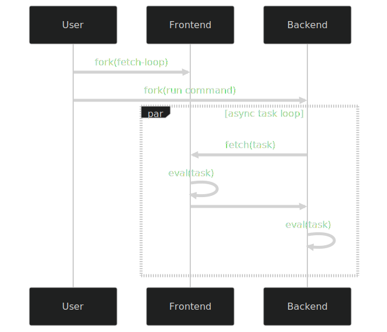

This template is inspired by the formats of [this](https://gist.github.com/kinten108101/1436f0545ffba9f40125153aa66fe915). We use it flexibly to express design tradeoffs.

## Formatter

In [568dc77](https://github.com/ttb-hcmut/.github/commits/568dc77), we introduced formatters, a preprocessing stage to add colors to stderr output.

1. We use formatters that can be combined.
2. We use formatters that can be one-way combined by extending with additional rules
3. We use the same formatter for all cases (current)

Exibit 1 is ideal. However, there's currently no formatter implementation in the OCaml ecosystem that allows combination [^redirect].

Exibit 2 was adopted for a while. This was implemented by the `Microcluster_exec.Format` formatters. These are extended versions of `Stdlib.Format` formatters in that they allow you to specify addition _styling rules_. By this system, the default Microcluster_exec semantics are implemented by `Microcluster_exec.Format.translate`, while the modifications to the Cmdliner recolors are implemented by `Microcluster_exec.Format.Cmdliner.Re.styles`. So, this method works. The issue is that there's a hierarchy between the default semantics and the Cmdliner recolors, where the former is prioritized / first applied. Furthermore, this styling rule system adds complexity to the preprocessing function.

Exhibit 3 is what we concluded with. The reason we initially didn't consider this is because of performance reason, because recoloring cmdliner was an exclusive task for cmdliner. But it's upon that we realize the big picture: from a cmdliner user perspective, there's no difference between the stderr output of cmdliner, and that of the rest of the app - the two should be seen as one. The `?err` argument in `Cmdliner.eval` is an customization override, but that isn't meant to break the picture. Exhibit 3 has best declarativeness, at the slight cost of performance. But from a high-level programming perspective, performance optimization should be an addition underneath the abstraction, not a mainline abstraction.

## Clientside interceptor

Regarding communication between the frontend interpreter (Micro-cluster Execute) and the backend interpreter (Python / UTop).

1. Frontend and backend define the code to communicate, as long as they follow the fs_socket protocol and the Controller spec.
2. Frontend defines the code to communicate, defines the protocol and spec, sends some portion to the backend  - inversion of control (current).

Kinten's opinion is, unless performance is in dire shape, prefer expression over performance.

In exhibit 1. It is the default way, classic client-server pattern, it is easy and straightforward. The challenge is that the protocol that the frontend and backend follows is only partially seen from each side: for the overview, you need a kind of document.

In exhibit 2. All communication logic is defined by the frontend; the flow of communication can be overly and readily observed in one file `/microcluster_exec/bin/main.ml` without jumping between different code repositories. The challenge is that there will be some performance implications; and there's difficulty in language: as we define this callback in OCaml-land, we have to translate and send this callback to Python-land. At least for the latter challenge, we invented `Microcluster_exec.Clientside`, a monadic way to write portable programs with the Python abstract syntax tree being the intermediate representation. Of course, all of this is further complicating the client-server pattern just for some improvement in expression and aesthetics. This pattern is being alert-marked as experimental.

[^redirect]: It's possible to redirect the output _channel_ of one formatter to a different channel. But how to apply this idea to different formatters is still unsolved.

## Composite interpreter

Microcluster\_exec is a composite interpreter. In the architecture of Microcluster_exec, there are two subinterpreters: the back-end interpreter that evaluates the program (Python, UTop, etc) and the front-end interpreter that intercepts the back-end interpreter during async task and delivers those tasks to the microcluster device for remote evaluation.

The flow can be shown by this simplified program in the ML Eio language

```ocaml
let command = Command.infer Sys.input_file Sys.other_args in
Communication.with_socket_open @@ fun socket ->
Switch.run @@ fun sw ->
( Fiber.fork ~sw @@ fun ->
  Communication.listen socket ~onrequest:begin fun request ->
    Microcluster.Rpc.eval request
    |> serialize
  end
);
( Fiber.fork ~sw @@ fun () ->
  Backend.run command ~ontask:begin fun task ->
    Communication.fetch socket task
    |> Python_ast.eval_value
  end
)
```

which can be rendered into the sequence diagram below


This composite architecture is optimized for modularity. The input code is guaranteed to be correctly interpreted: the code is understood by the back-end interpreter, an interpreter which can be customized (by changing the input command) to be any external program that the user expects to interpret their code [^backend].

[^backend]: currently there are some compromises: we only support two external programs — Python and UTop — for sane issue tracking, and the async functions must be marked with the `parallel()` decorator. 

## eDSL rules

The XXX eDSL is not OCaml, is not Python, it's a mix. By its nature, it's bound to be a frankenstein mess. But we want to do good things with it.

The main goal is that, most of the designs are about translation power i.e. how to output exactly the Python you want. However, a secondary goal is that writing should be pleasant i.e. the eDSL syntax should not be too crazy, and some Python patterns (e.g. arbitrary variable assignment) are too overpowered and error-prone so we should stray from those.

We try to be predictable. For example, given we're using an interpreter that serializes the eDSL into Python.

- Every initializer expression (`ref`, `import`, `def`) marks an identifier symbol generation
- Every overloadable let-binding (`let*`, `let+`, `>>=`, ...) marks a new line.
- Every block interior (`if_, for_, def_`) marks a new indent level.

## eDSL libraries

A. functorized modules (current)

```ocaml
type spec

module Json : sig
    include Importable
    module M (_: Context) : sig
        val dumps : dict expr -> string expr
        type blob

        (** instance methods of Python class "blob" *)
        module Blob : sig
            val to_string : blob expr -> string expr 
        end
    end
end

let+ json = import (module Json) in
let module Json = Json.M(val json) in
Json.dumps v (* ... *);
Json.Blob.to_string 
```

modules are first-class citizens of OCaml. You can "instantiate" modules through functors[^module-instantiate].

you can't overload the let binding for module-letting, so there's the extra line as syntax overhead, and there's room for human error.

B. class

```ocaml
module Json : sig
    type blob
end

val json : context -> <
    dumps : dict expr -> string expr

    blob : <
        to_string : Json.blob expr -> string expr
    >
>
```

the motivation was, if we have to instantiate the namespace before using it, wouldn't that be what classes are for?

class can be used easily in non-top scope

declaring and defining methods for class may be nice, but you can't have types and nested modules and nested classes in a class, you'll resort to modules for those tasks still, so the syntax switch is a bit jarring. (it's the author's informal opinion that OCaml class should only be used to wrap convenient ops together. Other than that.. well, OCaml classes are extremely limited compared to the modules-and-functors solution)

C. ?? 

## ppx-ftor

In OCaml, a universe can be implemented as a module, or a function with first-class module + bounded LATs.

There are benefits and costs, at user side vs. at developer side

First-class module is a vendor lock-in. You get best benefits but pay high cost, at both user side and developer side. It's unfair that we have to pay such cost. The authors didn't want such great benefits in the first place, as we mostly care about the user side.

ppx-ftor is a syntax sugar for benefits of user side only. For user it's function with first-class module with no LATs, for developer it's  functor. It's biased towards user experience, and this is exactly the trade-off we want.

[^module-instantiate]: the word "instantiate" is used to compare with classes in OOP, it sounds like "generating new instance". But actually there are two kinds of functors: generative functors that "generate new instance" and applicative functors that "maps to a submodule". The difference is when you "instantiate" multiple times to produce multiple "instances". For generative functors, these instances are unique / different. For applicative functors, these instances may just be "pointers" to the same submodule if the parameter module is the same. For most cases, people usually mean applicative functors. In some cases when you want each instance module to carry some unique states, use generative functors
