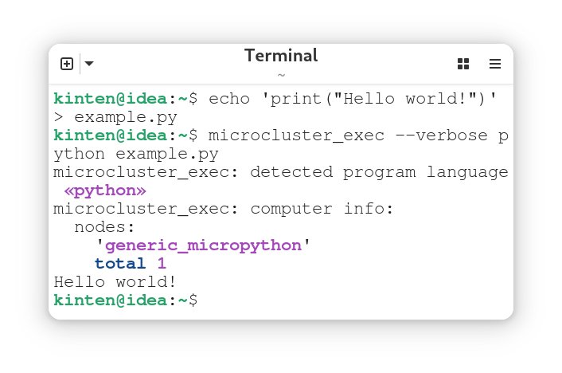
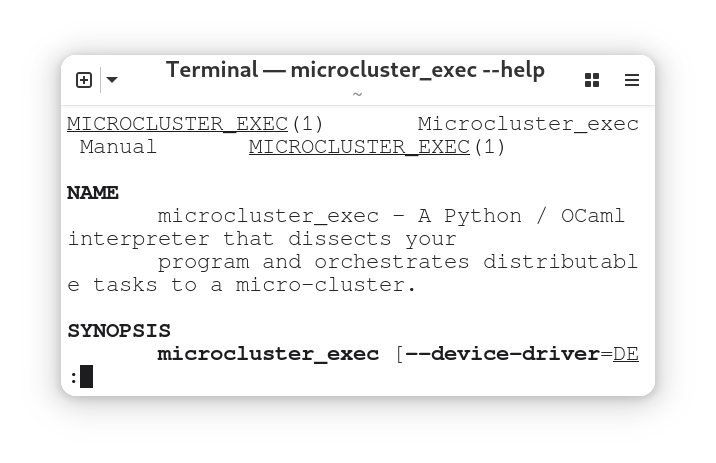

## Develop

Operating Systems:
- Linux
- Mac

Build Dependencies:
- make (part of Ubuntu's [build-essential](https://launchpad.net/ubuntu/+source/build-essential))
- [dune](https://dune.build/install)
- [opam](https://opam.ocaml.org/doc/Install.html)

Runtime Dependencies:
- [mpremote](https://pypi.org/project/mpremote/)

### First-time Setup

```sh
make init
```

### Build

```sh
make
```

### Install

```sh
make install
```

### Test

```sh
make test
```

> In practice, it's more convenient to run commands from one place without manually changing working directory. From root of the mono-repository, run any `make` command with the flag `-C microcluster_exec`; for example, `make -C microcluster_exec install`

## How to use

### Run

```sh
echo 'print("Hello world!")' > example.py
microcluster_exec --verbose python example.py
```

<p align="center">
  
</p>

### Help

```sh
microcluster_exec --help
```

<p align="center">
  
</p>
