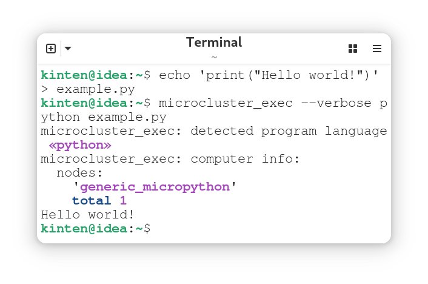
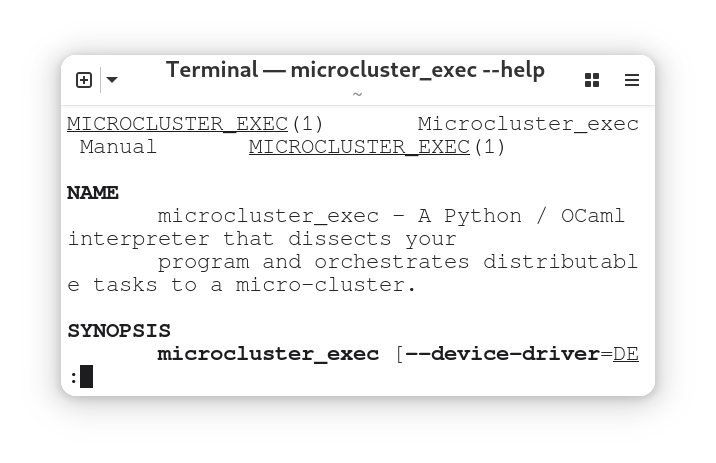

## Develop

Build Dependencies:
- dune
- make

Runtime Dependencies:
- mpremote

### Build

```sh
make -C microcluster_exec
```

### Install

```sh
make -C microcluster_exec install
```

### Test

```sh
make -C microcluster_exec test
```

## How to use

### Run

```sh
echo 'print("Hello world!")' > example.py
microcluster_exec --verbose python example.py
```

<p align="center">
  
</p>

### Help

```sh
microcluster_exec --help
```

<p align="center">
  
</p>
